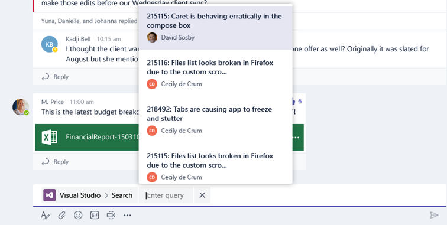

# Compose Extensions (Preview)

>Note: compose extensions are available in [Public Developer Preview](publicpreview.md) only.  Additionally, many features in this document are under construction, and as such, subject to change.

# Introduction and overview
Compose extensions are a powerful new way for users to engage with your app within Microsoft Teams. This capability makes it easy for users to query for information from your service and post them into conversations in the form of rich cards, right into the channel conversation.


### Examples
* Work items and bugs
* Customer support tickets
* Usage charts and reports
* Images and media content
* Sales opportunities and leads

# Adding a compose extension to your app
Building a compose extension involves implementing familiar Microsoft Teams developer platform concepts like bot APIs, rich cards, and embedded web content (tabs).

At its core, a compose extension is a cloud-hosted service that listens to user requests and responds with either structured data (cards) or rich media. You integrate your service with Microsoft Teams via the bot framework APIs, which establishes the protocol for receiving and replying to user requests.


## Register in the Bot Framework

To get started, you must first register with the Microsoft Bot Framework. Visit [this link](https://msdn.microsoft.com/en-us/microsoft-teams/botscreate) for instructions. The bot app ID and callback endpoints defined here will be used in your compose extension to receive and respond to user requests. Remember to enable the Microsoft Teams channel for your bot.

Record your bot’s app ID – you will need to supply this value in your app manifest.

## Update your app manifest
As with bots and tabs, you will update your app’s [manifest](schema.md) to include the compose extension properties. These properties govern how your compose extension appear and behave in the Microsoft Teams client. Compose Extensions are only supported in v1.0 and above of the manifest.

### Declare your compose extension
To add a compose extension, simply include a new top-level JSON structure in your manifest with the `inputExtensions` property. As with other app capabilities, this is an array that takes 1 or
more capability definitions.

Each extension definition is an object that has the following structure:
| Property name | Purpose | Required? |
|---|---|---|
| `botId` | Bot framework app ID | Y |
| `scopes` | Array declaring whether this extension can be added to `personal` or `team` scopes | Y |
| `commands` | Array of commands that this compose extension supports | Y |


### Define commands
Your compose extension should declare one or more commands. Each command appears in Microsoft Teams as a potential interaction from the UI-based entry point.


The Teams UI will also surface the commands and suggest them via type-down when users invoke your app from the compose box.



In the app manifest, each command item is an object with the following structure:
| Property name | Purpose | Required? |
|---|---|---|
| `id` | Unique ID that you assign to this command. The user request will include this ID | Y |
| `title` | Command name. This should be a user-friendly value | Y |
| `description` | String that appears to users to indicate the purpose of this command | Y |
| `parameters` | List of parameters | Y |
| `parameter.name` | The name of the parameter as it appears in the client.  This is included in the user request. | Y |
| `parameter.description` | User-friendly string that describes this parameter’s purposes. | Y |

#### Complete app manifest example
```json
{
  "$schema":
  "https://statics.teams.microsoft.com/sdk/v1.0/manifest/MicrosoftTeams.schema.json",
  "manifestVersion": "1.0",
  "version": "1.0",
  "id": "ef9c57b6-7a92-4ae5-99cd-139f9a76bff0",
  "reverseDomainId": "com.microsoft.teams.samples.bing ",
  "developer": {
    "name": "John Developer",
    "websiteUrl": "http://bingbotservice.azurewebsites.net/",
    "privacyUrl": "http://bingbotservice.azurewebsites.net/privacy",
    "termsOfUseUrl": "http://bingbotservice.azurewebsites.net/termsofuse"
  },
  "name": "Bing",
  "description": {
    "short": "Find Bing search results",
    "full": "Find Bing search results and share them with your team members."
  },
  "icons": {
    "44": "https://pbs.twimg.com/profile_images/aceaeaojo18201/zlVaaEoG.jpg",
    "88": "https://pbs.twimg.com/profile_images/aceaeaojo18201/zlVaaEoG.jpg"
  },
  "accentColor": "#ff6a00",
  "composeExtensions": [
    {
      "botId": "57a3c29f-1fc5-4d97-a142-35bb662b7b23",
      "scopes": [
        "personal"
      ],
      "commands": [{
        "id": "searchCmd",
        "description": "Search Bing for information on the web",
        "title": "Search",
        "parameters": [{
          "name": "keyword",
          "title": "keyword",
          "description": "Web search keywords",
        }]
      }]
    }
  ],
  "permissions": [
    "identity",
    "messageTeamMembers"
  ],
  "validDomains": [
    "bingbotservice.azurewebsites.net",
    "*.bingbotservice.azurewebsites.net"
  ]
}
```
 
## Test via side loading
 
You can test your compose extension by side loading your app. To do this, navigate to a team and its Apps dashboard. Click on the "Sideload a bot or tab" link in the bottom right of the page. Browse to the .zip file containing your app’s manifest.

If the manifest is loaded correctly, your app will appear in the list of that team’s installed apps. 

To invoke the compose extension, navigate to any of your chats or channels. Click on the "..." below the message compose box. Your compose extension’s commands should now appear in the list within the dialog. Click on any command to bring up the search page.

# Receive and respond to queries
Now that you’ve got your app up and running, it’s time to add some functionality. Every request to your compose extension is done via an `Activity` that is posted to your callback URL. The request will contain information about the user command, such as ID and parameter values. The request will also supply metadata about the context in which your extension was invoked, including user and tenant ID, along with chat ID or channel and team IDs.

## Receiving user requests
When a user performs a query, Microsoft Teams will send your service a standard Bot Framework activity. It should perform its logic for activity with type of invoke.

In addition to the standard bot activity properties, the payload will contain the following relevant request metadata:

|Property name|Purpose|
|---|---|
|`type`|Will be `invoke`|
|`name`|Type of command that is issued to your service. For now, the only valid value will be `inputExtension/query`|
|`from.id`|ID of the user that sent the request|
|_`from.name*`_|Name of the user that sent the request|
|_`channelData.tenant.id*`_|Azure ActiveDirectory tenant ID|
|_`channelData.channel.id*`_|If the request was made in a channel, this will be the channel ID|
|_`channelData.team.id*`_|If the request was made in a channel, this will be the team ID|
|`clientInfo`|entity Additional metadata about the user’s client, such as locale/language and the type of client|
 
_*Coming soon_


The request parameters itself will be found in the value object, which includes the following properties:

| Property name | Purpose |
|---|---|
| `commandId` |T he name of the command invoked by the user, matching one of declared commands in the app manifest |
| `parameters` | Array of parameters. Each parameter object contains the parameter name, along with the parameter value provided by the user |
| `queryOptions` | Pagination parameters: <br>`skip`: skip count for this query<br>`count`: number of elements to return |

Note: You should authenticate any request to your service. Visit this [link](https://msdn.microsoft.com/en-us/microsoft-teams/botsmessages) for more detailed documentation on receiving messages from the Bot Framework.

#### Request example
```json
{
  "name": "composeExtension/query",
  "value": {
    "commandId": "insertWikipedia",
    "parameters": [
      {
        "name": "searchCmd",
        "value": "test keyword"
      }
    ],
    "queryOptions":{  
       "skip":0,
       "count":25
    }
  },
  "type": "invoke",
  "timestamp": "2017-04-10T22:57:00.958Z",
  "entities": [
    {
      "locale": "en-US",
      "country": "US",
      "platform": "Web",
      "type": "clientInfo"
    }
  ],
  "text": "",
  "attachments": [],
  "address": {
    "id": "f:9090881878008516650",
    "channelId": "msteams",
    "user": {
      "id": "29:1zjn84N5K1VLGivb-PQv2EQiExDM0IG81CRKqjHSDoXsWCTdZoU2iWWXhVhWL9fB8emncs6czdAwXjd-KU-qtQ"
    },
    "conversation": {
      "id": "19:7705841b240044b297123ad7f9c99217@thread.skype"
    },
    "bot": {
      "id": "28:e6968ea3-3dcd-4f21-8e13-b1794d7f3b4d",
      "name": "TestBot"
    },
    "serviceUrl": "https://smba.trafficmanager.net/amer-client-ss.msg/",
    "useAuth": true
  },
  "channelData": {
    "channel": {
      "id": "19:xxxxx@thread.skype"
    },
    "team": {
      "id": "19:xxxxx@thread.skype"
    },
    "tenant": {
      "id": "72f988bf-86f1-41af-91ab-2d7cd011db47"
    }
  },
  "source": "msteams"
}
```

## Responding

When the user performs a query, Microsoft Teams will issue a synchronous HTTP request to your service. At that point, your code will have 5 seconds to provide an HTTP response to the request. During this  time, your service can perform additional lookup, or any other business logic needed to serve the request.

Your service should respond with the results matching the user query. The response must indicate 200 OK HTTP status and a valid application/json object with the following body:

|Property name|Purpose|
|---|---|
|`composeExtension`|Top-level response envelope|
|`composeExtension.type`|Should be of value `result`|
|`composeExtension.attachmentLayout`|`list`: list of card objects containing thumbnail, title, and text fields.<br>`grid`: grid of media objects, showing preview thumbnail for each one.|
|`composeExtension.attachments`|Array of valid bot attachment objects. Currently the following types are supported:<br>`application/vnd.microsoft.card.thumbnail` <br>`application/vnd.microsoft.card.hero`<br>`application/vnd/microsoft.teams.card.o365connector`|

### Response card types and previews

We support the following attachment types:
* Thumbnail card
* Hero card
* O365 connector card

Read the full documentation on the thumbnail and hero card types [here](https://msdn.microsoft.com/en-us/microsoft-teams/botsmessages). Additional documentation regarding the O365 connector card is available [here](https://dev.outlook.com/Connectors/Reference).

The result list is displayed in the Microsoft Teams UI with a preview of each item. The preview is generated in one of two ways:
* Using the `preview` property within the `attachment` object
* Extracted from the basic `title`, `text`, and `image` properties of the attachment. These are used only if the `preview` property is not set and these properties are available.

#### Response example
```json
{
  "composeExtension":{
    "type":"result",
    "channelData":{
    },
    "attachmentLayout":"list",
    "attachments":[
      {
        "contentType":"application/vnd.microsoft.teams.card.o365connector",
        "content":{
          "sections":[
            {
              "activityTitle":"[85069]: Create a cool app",
              "activityImage":"https://<ImageUrl1>"
            },
            {
              "title":"Details",
              "facts":[
                {
                  "name":"Assigned to:",
                  "value":"[Larry Brown](mailto:larryb@company.com)"
                },
                {
                  "name":"State:",
                  "value":"Active"
                }
              ]
            }
          ]
        },
        "preview":{
        "contentType":"application/vnd.microsoft.card.thumbnail",
        "content":{
            "title":"85069: Create a cool app",
            "images":[
              {
              "url":"https://<ImageUrl1>"
              }
            ]
          }
        }
      }
    ]
  }
}
```

## Default query
When the user first brings up the compose extension dialog, Microsoft Teams will issue a "default" query. Your service can respond to this query with a set of prepopulated results. This can be useful for displaying, for instance, recently viewed items, favorites, or any other information that is not dependent on user input.

The default query will have the same structure as any regular user query, except with a parameter `initialRun` whose Boolean value is `true`.

# Authenticating users
>Under development

If your service requires user authentication, then you will want to sign the user in before he or she can use the compose extension. If you have written a bot or a tab that signs the user in, this
section should be familiar.

The sequence is as follows:
1. User issues a query, or the default query is automatically sent to your service.
2. Your service checks if the user has first authenticated by inspecting the Teams user ID.
3. If the user has not authenticated, send back a `login` action including the authentication URL.
4. Microsoft Teams client will launch a popup window hosting the webpage for the given authentication URL.
5. Once login completes, the window closes, and the query is re-issued.

## Login action
When responding to an unauthenticated user, you must include the authentication URL in a suggested action.

Note: For the login experience to be hosted in a Teams popup, the domain portion of the URL must be in your app’s list of valid domains.

### Authentication window
Your login experience should be responsive and fit within a popup window. It should integrate with the Microsoft Teams JavaScript library – read the full documentation [here](https://msdn.microsoft.com/en-us/microsoft-teams/jslibrary).

As with other embedded experiences running inside Microsoft Teams, your code inside the window needs to first call `microsoftTeams.initialize()`.

Once the sign-in is completed successfully, your code within the popup should call `microsoftTeams.authentication.notifySuccess()` or `microsoftTeams.authentication.notifyFailure()` in order to pass control back to the Microsoft Teams app.

# Configuration and settings
> Under development

# Returning errors
> Under development


# SDK support
## .NET SDK
> Under development

For now, to receive and handle queries with the Bot Framework .NET SDK, you can check for the invoke action type on the incoming activity. Note the change of the incoming parameter to
`JObject` rather than Bot Framework `Activity` type.

#### Example code
```csharp
public HttpResponseMessage Post(JObject activity) {
HttpResponseMessage response;
if (activity["type"].ToString() == "invoke" && activity["name"].ToString() == "composeExtension/query") {

    // your code here

    response.Content = new StringContent(responseJson.ToString(), System.Text.Encoding.UTF8, "application/json");
    return response;
}

// Failure case catch-all.
response = Request.CreateResponse(HttpStatusCode.BadRequest);
response.Content = new StringContent("Invalid request! This API only supports compose extension requests. Check your query and try again");
return response;
}
```

## Node.JS SDK
> Under development

A companion SDK is under development. For now, to receive and handle queries, you will need to register an Invoke action handler.

#### Example code
```js
const builder = require("botbuilder");

var c = new builder.ChatConnector({
    appId: <your appId>,
    appPassword: <your app password>
});

c.onInvoke((msg, callback) => {
    // your code here
    // This is needed in order to return any data.
    
    // Response is a json object as described above
    callback(error, response);
});
```
