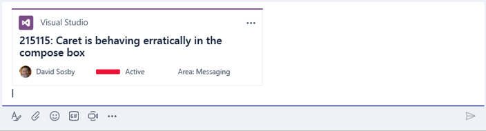
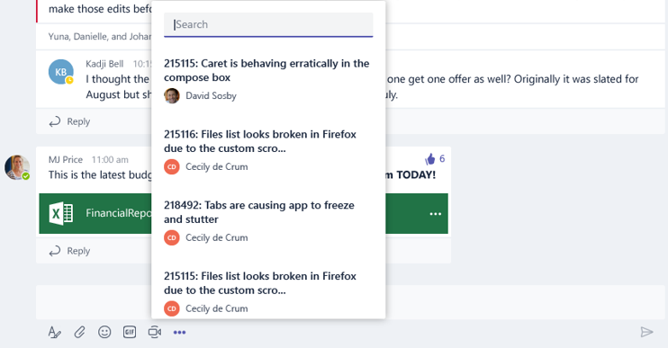

# Compose Extensions (Preview)

>Note: compose extensions are available in [Public Developer Preview](publicpreview.md) only.  Additionally, many features in this document are under construction, and as such, subject to change.

# Introduction and overview
Compose extensions are a powerful new way for users to engage with your app within Microsoft Teams.  This capability makes it easy for users to query for information from your service and post them into conversations in the form of rich cards, right into the channel conversation.




### Examples
* Work items and bugs
* Customer support tickets
* Usage charts and reports
* Images and media content
* Sales opportunities and leads

# Adding a compose extension to your app
Building a compose extension involves implementing familiar Microsoft Teams developer platform concepts like bot APIs, rich cards, and tabs.

At its core, a compose extension is a cloud-hosted service that listens to user requests and responds with either structured data (cards) or rich media.  You integrate your service with Microsoft Teams via the bot framework APIs, which establishes the protocol for receiving and replying to user requests.


## Register in the Bot Framework

If you haven't done so already, you must first register a bot with the Microsoft Bot Framework. Visit [this link](https://msdn.microsoft.com/en-us/microsoft-teams/botscreate) for instructions.  The Microsoft app ID and callback endpoints for your bot, as defined there, will be used in your compose extension to receive and respond to user requests.  Remember to enable the Microsoft Teams channel for your bot.

Record your bot’s app ID – you will need to supply this value in your app manifest.

## Update your app manifest
As with bots and tabs, you will update your app’s [manifest](schema.md) to include the compose extension properties. These properties govern how your compose extension appear and behave in the Microsoft Teams client. Compose Extensions are only supported in v1.0 and above of the manifest.

### Declare your compose extension
To add a compose extension, simply include a new top-level JSON structure in your manifest with the `composeExtensions` property.  Currently, you are limited to creating a single compose extension for your app.

The extension definition is an object that has the following structure:

| Property name | Purpose | Required? |
|---|---|---|
| `botId` | The unique Microsoft App ID for the bot as registered with the Bot Framework. This should typically be the same as the ID for your overall Teams app| Y |
| `scopes` | Array declaring whether this extension can be added to `personal` or `team` scopes | Y |
| `commands` | Array of commands that this compose extension supports.  Note that currently this is limited to one command. | Y |


### Define commands
Your compose extension should declare one command, which will appear then the user selects your app from the `...` option in the chat window. 



In the app manifest, your command item is an object with the following structure:

| Property name | Purpose | Required? |
|---|---|---|
| `id` | Unique ID that you assign to this command.  The user request will include this ID | Y |
| `title` | Command name.  This value appears in the UI. | Y |
| `description` | Help text indicating what this command does. This value appears in the UI. | Y |
| `initialRun` | If set to true, indicates this command should be executed as soon as the user chooses this command in the UI | N |
| `parameters` | List of parameters | Y |
| `parameter.name` | The name of the parameter.  This is sent to your service in the user request. | Y |
| `parameter.description` | Describes this parameter’s purposes or example of the value that should be provided. This value appears in the UI. | Y |
| `parameter.title` | Short user-friendly parameter title or label | Y |

#### Complete app manifest example
```json
{
  "$schema": "https://statics.teams.microsoft.com/sdk/v1.0/manifest/MicrosoftTeams.schema.json",
  "manifestVersion": "1.0",
  "version": "1.0",
  "id": "57a3c29f-1fc5-4d97-a142-35bb662b7b23",
  "packageName": "com.microsoft.teams.samples.bing",
  "developer": {
    "name": "John Developer",
    "websiteUrl": "http://bingbotservice.azurewebsites.net/",
    "privacyUrl": "http://bingbotservice.azurewebsites.net/privacy",
    "termsOfUseUrl": "http://bingbotservice.azurewebsites.net/termsofuse"
  },
  "name": {
    "short": "Bing",
    "full": "Bing"
  },
  "description": {
    "short": "Find Bing search results",
    "full": "Find Bing search results and share them with your team members."
  },
  "icons": {
    "outline": "https://pbs.twimg.com/profile_images/aceaeaojo18201/zlVaaEoG.jpg",
    "color": "https://pbs.twimg.com/profile_images/aceaeaojo18201/zlVaaEoG.jpg"
  },
  "accentColor": "#ff6a00",
  "composeExtensions": [
    {
      "botId": "57a3c29f-1fc5-4d97-a142-35bb662b7b23",
      "scopes": [
        "personal"
      ],
      "commands": [{
          "id": "searchCmd",
          "description": "Search Bing for information on the web",
          "title": "Search",
          "initialRun": "true",
          "parameters": [{
            "name": "searchKeyword",
            "description": "Enter your search keywords",
            "title": "Keywords"
          }]
        }
      ]
    }
  ],
  "permissions": [
    "identity",
    "messageTeamMembers"
  ],
  "validDomains": [
    "bingbotservice.azurewebsites.net",
    "*.bingbotservice.azurewebsites.net"
  ]
}
```
 
## Test via side loading

You can test your compose extension by side loading your app.  To do this, navigate to a team and its Apps dashboard.  Click on the "Sideload an app" link in the bottom right of the page.  Browse to the .zip file containing your app’s manifest.

If the manifest is loaded correctly, your app will appear in the list of that team’s installed apps. 

To invoke the compose extension, navigate to any of your chats or channels.  Click on the "..." below the message compose box.  Your compose extension’s commands should now appear in the list within the dialog.  Click on any command to bring up the search page.

>Note: your app will only appear in channels if you have declared the `team` scope. Similarly, it will only appear in your chats if it supports the `personal` scope.

# Receive and respond to queries
Now that you’ve got your app up and running, it’s time to add some functionality.  Every request to your compose extension is done via an `Activity` that is posted to your callback URL.  The request will contain information about the user command, such as ID and parameter values.  The request will also supply metadata about the context in which your extension was invoked, including user and tenant ID, along with chat ID or channel and team IDs.

## Receiving user requests
When a user performs a query, Microsoft Teams will send your service a standard Bot Framework activity.  It should perform its logic for activity with type of invoke.

In addition to the standard bot activity properties, the payload will contain the following relevant request metadata:

|Property name|Purpose|
|---|---|
|`type`| Will be `invoke` |
|`name`| Type of command that is issued to your service.  For now, the only valid value will be `composeExtension/query` |
|`from.id`| ID of the user that sent the request |
|`from.name`| Name of the user that sent the request |
|`channelData.tenant.id`| Azure ActiveDirectory tenant ID |
|`channelData.channel.id`| If the request was made in a channel, this will be the channel ID |
|`channelData.team.id`| If the request was made in a channel, this will be the team ID |
|`clientInfo`| entity Additional metadata about the user’s client, such as locale/language and the type of client |


The request parameters itself will be found in the value object, which includes the following properties:

| Property name | Purpose |
|---|---|
| `commandId` | The name of the command invoked by the user, matching one of declared commands in the app manifest |
| `parameters` | Array of parameters.  Each parameter object contains the parameter name, along with the parameter value provided by the user |
| `queryOptions` | Pagination parameters: <br>`skip`: skip count for this query<br>`count`: number of elements to return |

Note: You should authenticate any request to your service.  Visit this [link](https://msdn.microsoft.com/en-us/microsoft-teams/botsmessages) for more detailed documentation on receiving messages from the Bot Framework.

#### Request example
```json
{
  "name": "composeExtension/query",
  "value": {
    "commandId": "searchCmd",
    "parameters": [
      {
        "name": "searchKeywords",
        "value": "Toronto"
      }
    ],
    "queryOptions": {
      "skip": 0,
      "count": 25
    }
  },
  "type": "invoke",
  "timestamp": "2017-05-01T15:45:51.876Z",
  "id": "f:622749630322482883",
  "channelId": "msteams",
  "serviceUrl": "https://smba.trafficmanager.net/amer-client-ss.msg/",
  "from": {
    "id": "29:1C7dbRrC_5yzN1RGtZIrcWT0xz88KPGP9sxdpVpV8sODlgPHeQE9RqQ02hnpuKzy6zZ-AaZx6swUOMj_Dsdse3TQ4sIaeebbFBF-VgjJy_nY",
    "name": "Larry Jin"
  },
  "conversation": {
    "id": "19:skypespaces_8198cfe0dd2647ae91930f0974768a40@thread.skype"
  },
  "recipient": {
    "id": "28:b4922ea1-5315-4fd0-9b21-d941ab06e39f",
    "name": "TheComposeExtensionDev"
  },
  "entities": [
    {
      "locale": "en-US",
      "country": "US",
      "platform": "Web",
      "type": "clientInfo"
    }
  ]
}
```

## Responding

When the user performs a query, Microsoft Teams will issue a synchronous HTTP request to your service.  At that point, your code will have 5 seconds to provide an HTTP response to the request.  During this  time, your service can perform additional lookup, or any other business logic needed to serve the request.

Your service should respond with the results matching the user query.  The response must indicate 200 OK HTTP status and a valid application/json object with the following body:

|Property name|Purpose|
|---|---|
|`composeExtension`|Top-level response envelope|
|`composeExtension.type`|Should be of value `result`|
|`composeExtension.attachmentLayout`|`list`: list of card objects containing thumbnail, title, and text fields. This is currently the only supported layout type, with more coming soon.|
|`composeExtension.attachments`|Array of valid bot attachment objects.  Currently the following types are supported:<br>`application/vnd.microsoft.card.thumbnail` <br>`application/vnd.microsoft.card.hero`<br>`application/vnd/microsoft.teams.card.o365connector`|

### Response card types and previews

We support the following attachment types:
* Thumbnail card
* Hero card
* O365 connector card

Read the full documentation on the thumbnail and hero card types [here](https://msdn.microsoft.com/en-us/microsoft-teams/botsmessages).  Additional documentation regarding the O365 connector card is available [here](https://dev.outlook.com/Connectors/Reference).

The result list is displayed in the Microsoft Teams UI with a preview of each item.  The preview is generated in one of two ways:
* Using the `preview` property within the `attachment` object
* Extracted from the basic `title`, `text`, and `image` properties of the attachment.  These are used only if the `preview` property is not set and these properties are available.

#### Response example
```json
{
  "composeExtension":{
    "type":"result",
    "channelData":{
    },
    "attachmentLayout":"list",
    "attachments":[
      {
        "contentType":"application/vnd.microsoft.teams.card.o365connector",
        "content":{
          "sections":[
            {
              "activityTitle":"[85069]: Create a cool app",
              "activityImage":"https://<ImageUrl1>"
            },
            {
              "title":"Details",
              "facts":[
                {
                  "name":"Assigned to:",
                  "value":"[Larry Brown](mailto:larryb@company.com)"
                },
                {
                  "name":"State:",
                  "value":"Active"
                }
              ]
            }
          ]
        },
        "preview":{
        "contentType":"application/vnd.microsoft.card.thumbnail",
        "content":{
            "title":"85069: Create a cool app",
            "images":[
              {
              "url":"https://<ImageUrl1>"
              }
            ]
          }
        }
      }
    ]
  }
}
```

## Default query
When the user first brings up the compose extension dialog, Microsoft Teams will issue a "default" query.  Your service can respond to this query with a set of prepopulated results.  This can be useful for displaying, for instance, recently viewed items, favorites, or any other information that is not dependent on user input.

The default query will have the same structure as any regular user query, except with a parameter `initialRun` whose Boolean value is `true`.

#### Request example
```json
{
  "type": "invoke",
  "name": "composeExtension/query",
  "value": {
    "commandId": "searchCmd",
    "parameters": [
      {
        "name": "initialRun",
        "value": "true"
      }
    ],
    "queryOptions": {
      "skip": 0,
      "count": 25
    }
  },
...
}
```

# Identifying the user
Every request to your services includes the obfuscated ID of the user that performed the request, as well as the display name.

```json
"from": {
  "id": "29:1C7dbRrC_5yzN1RGtZIrcWT0xz88KPGP9sxdpVpV8sODlgPHeQE9RqQ02hnpuKzy6zZ-AaZx6swUOMj_Dsdse3TQ4sIaeebbFBF-VgjJy_nY",
  "name": "Larry Jin"
},
```

The `id` value is guaranteed to be that of the authenticated Teams user.  It can be used as a key to lookup credentials or any cached state in your service.
In addition, each request contains the user’s Azure ActiveDirectory tenant ID, which can be used to identify the user’s organization.
If applicable, the request also contains the team and channel IDs from which the request originated.


# Authentication

If your service requires user authentication, then you will want to sign the user in before he or she can use the compose extension.  If you have written a bot or a tab that signs the user in, this
section should be familiar.

The sequence is as follows:
1.	User issues a query, or the default query is automatically sent to your service.
2.	Your service checks if the user has first authenticated by inspecting the Teams user ID.
3.	If the user has not authenticated, send back a `login` action including the authentication URL.
4.	Microsoft Teams client will launch a popup window hosting your webpage using the given authentication URL.
5.	Once the user logs in, you should close your window and send an "authentication code" to the Teams client.
6.	The Teams client will then reissue the query your service, which includes the authentication code passed in step #5.

Your service should check that the authentication code received in step #6 matches the one from step #5.  This ensures that a malicious user does not try to spoof or compromise the login flow.  This effectively "closes the loop" to finish the secure authentication sequence.

## Responding with a login action
To prompt an unauthenticated user to log in, respond with a suggested action which includes the authentication URL.

#### Response example
```json
{
  "composeExtension":{
    "type":"auth",
    "channelData":{
    },
    "suggestedActions":[
      {
        "type": "openApp",
        "value": "https://loginpage.com/auth",
        "title": "Log into this app"
      }
    ]
  }
}
```

>Note: For the login experience to be hosted in a Teams popup, the domain portion of the URL must be in your app’s list of valid domains.

## Starting the login flow
Your login experience should be responsive and fit within a popup window. It should integrate with the Microsoft Teams JavaScript library, which uses message passing – read the full documentation [here](jslibrary.md).

As with other embedded experiences running inside Microsoft Teams, your code inside the window needs to first call `microsoftTeams.initialize()`.  If your code performs an OAuth flow, you should pass the Teams user ID into your window, which also then gets passed to the OAuth login URL.

## Completing the login flow
When the login request completes and redirects back to your page, it should perform the following steps
1.	Generate a security code – this can be a random number. You need to cache this code on your service, along with the credentials obtained through the login flow (e.g. OAuth 2.0 tokens)
2.	Call `microsoftTeams.authentication.notifySuccess` and pass in the security code.

At this point, the window will be closed and control is passed to the Teams client. The client will now reissue the original user query, along with the security code in the `authenticationCode` property. Your code should use the security code to look up the credentials stored above to complete the authentication sequence. Your service can now complete the user request.

#### Reissued request example
```json
{
    "name": "composeExtension/query",
    "value": {
        "commandId": "insertWiki",
        "parameters": [{
            "name": "searchKeyword",
            "value": "lakers"
        }],
        "authenticationCode": "12345",
        "queryOptions": {
            "skip": 0,
            "count": 25
        }
    },
    "type": "invoke",
    "timestamp": "2017-04-26T05:18:25.629Z",
    "entities": [{
        "locale": "en-US",
        "country": "US",
        "platform": "Web",
        "type": "clientInfo"
    }],
    "text": "",
    "attachments": [],
    "address": {
        "id": "f:7638210432489287768",
        "channelId": "msteams",
        "user": {
            "id": "29:1A5TJWHkbOwSyu_L9Ktk9QFI1d_kBOEPeNEeO1INscpKHzHTvWfiau5AX_6y3SuiOby-r73dzHJ17HipUWqGPgw"
        },
        "conversation": {
            "id": "19:7705841b240044b297123ad7f9c99217@thread.skype"
        },
        "bot": {
            "id": "28:c073afa8-7e77-4f92-b3e7-aa589e952a3e",
            "name": "maotestbot2"
        },
        "serviceUrl": "https://smba.trafficmanager.net/amer-client-ss.msg/",
        "useAuth": true
    },
    "source": "msteams"
}
```

# SDK support
## .NET SDK

To receive and handle queries with the Bot Framework .NET SDK, you can check for the invoke action type on the incoming activity, then use the Teams SDK helper method to determine if it's a compose extension activity.

#### Example code
```csharp
public async Task<HttpResponseMessage> Post([FromBody]Activity activity)
{
    if (activity.Type == ActivityTypes.Invoke) // Received an invoke
    {
        if (activity.IsComposeExtensionQuery())
        {
            // This is the response object that will get sent back to the compose extension request.
            ComposeExtensionResponse response = null;

            // This helper method gets the query as an object.
            var query = activity.GetComposeExtensionQueryData();

            if (query.CommandId == null && query.Parameters == null && query.Parameters.Count > 0)
            {
                // query.Parameters has the parameters sent by client
                var results = new ComposeExtensionResult()
                {
                    AttachmentLayout = "list",
                    Type = "result",
                    Attachments = new List<ComposeExtensionAttachment>(),
                };
            }

            // Return the response
            return Request.CreateResponse<ComposeExtensionResponse>(HttpStatusCode.OK, invokeResponse);
        } else
        {
            // Handle other types of Invoke activities here.
        }
    } else {
      // Failure case catch-all.
      var response = Request.CreateResponse(HttpStatusCode.BadRequest);
      response.Content = new StringContent("Invalid request! This API only supports compose extension requests. Check your query and try again");
      return response;
    }
}
```

## Node.JS SDK
The Teams Node SDK provides helper objects and methods to simplify receiving, processing, and responding to compose extension requests.

#### Example code
```js
require('dotenv').config();

import * as restify from 'restify';
import * as builder from 'botbuilder';
import * as teamBuilder from 'botbuilder-teams';

class App {
    run() {
        const server = restify.createServer();
        let teamChatConnector = new teamBuilder.TeamsChatConnector({
            appId: process.env.MICROSOFT_APP_ID,
            appPassword: process.env.MICROSOFT_APP_PASSWORD
        });

        // Command Id must match what's defined in manifest
        teamChatConnector.onQuery('<%= commandId %>',
            (event: builder.IEvent,
            query: teamBuilder.ComposeExtensionQuery,
            callback: (err: Error, result: teamBuilder.IComposeExtensionResponse, statusCode: number) => void) => {
                // Check for intialRun, i.e. when you should return default results
                // if (query.parameters[0].name === 'initialRun') {}

                // Check query.queryOptions.count and query.queryOptions.skip for paging

                // Return auth response
                // let response = teamBuilder.ComposeExtensionResponse.auth().actions([
                //     builder.CardAction.openUrl(null, 'https://authUrl', 'Please sign in')
                // ]).toResponse();

                // Return config response
                // let response = teamBuilder.ComposeExtensionResponse.config().actions([
                //     builder.CardAction.openUrl(null, 'https://configUrl', 'Please sign in')
                // ]).toResponse();

                // Return result response
                let response = teamBuilder.ComposeExtensionResponse.result('list').attachments([
                    new builder.ThumbnailCard()
                        .title('Test thumbnail card')
                        .text('This is a test thumbnail card')
                        .images([new builder.CardImage().url('https://bot-framework.azureedge.net/bot-icons-v1/bot-framework-default-9.png')])
                        .toAttachment()
                ]).toResponse();
                callback(null, response, 200);
            });
        server.post('/api/composeExtension', teamChatConnector.listen());
        server.listen(process.env.PORT, () => console.log(`listening to port:` + process.env.PORT));
    }
}

const app = new App();
app.run();
```
