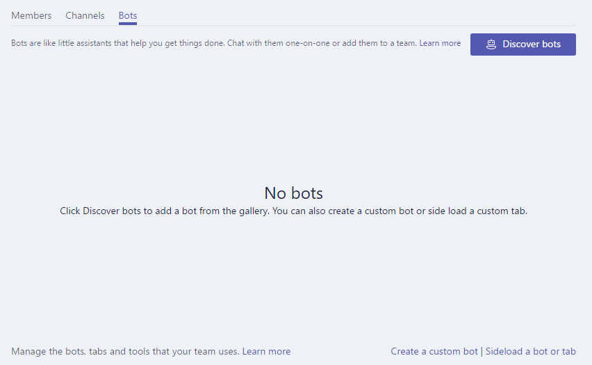
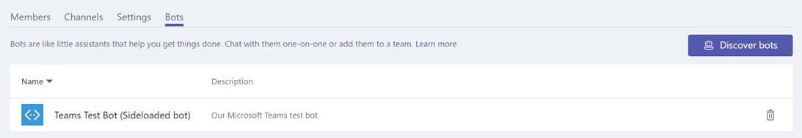

# Sideloading your app in a team

In order to test your app experience within teams, you'll need to sideload your app using the instructions below.  This adds the app to the team you've selected, and you and your team members can interact with it like an end user.

For bots designed only for 1:1 contexts, see [here](botsadd.md) for an alternate way to access for testing purposes.

> **Note** Sideloading an updated package for an existing App with a Bot may not show Tab changes when viewed through the Conversations window.  We recommend you access via the Apps fly-out, or test on a clean test environment.

## Create your sideload package

For both development and final Store Submission, you must create a sideloadable package which contains the information to describe your experience.  The package, a zip file, contains the application manifest and icons that uniquely describes your experience.  

To create your sideload package, please review the full documentation [here](createpackage.md).

## Load your package into a team

With your package created, you can now load it into a team of your choosing.  This adds the experience as an available integration for all users in the selected team.

> **Note** In order for sideloading to work, your tenant admin must first permit sideloading ([more info](setup.md))

1.  Create a new team for testing, if necessary.  Click **Create team** at the bottom of the left-hand panel.

2.  On the team you wish to load it, click on the overflow (“…”), and select View team. 

   

> **Note** You must be the team owner, or the owner must allow users to add the appropriate app type(s) for this functionality to appear.

3.	Select the Bot tab, then click on "Sideload a bot or tab" on the lower right.

> **Note** This same flow works not only for bots, but all other app extension types as well.

   

4.	Browse to and select your zip package from your computer.

5.	You will see your sideloaded app in the list.

   

## Accessing your sideloaded configurable tab

With the app loaded in the team, users may pin the tab to any channel on the team using the standard tab gallery flow:

1. Go to a channel in the team.  Click **+** to the right of the existing tabs.

2. Select your tab from the gallery that appears.

3. Accept the consent prompt.

4. Configure your tab via its [configuration page](createconfigpage.md) and click **Save**. 

## Accessing your sideloaded bot
 
When you add a bot to the team, it should be usable by anyone on that team, inside and outside the team channels, depending on bot scope definition.  You and other team members will see a post in the General channel indicating that the bot has been added to the team.

For a teams-enabled bot, you can start by invoking your bot by @mentioning the name of the bot, which should autocomplete.

To test direct chats with your bot, you can either access it via the App home, @mention it in a channel, or search for it in the 'New Chat` window. 

## Accessing your sideloaded connector

With the app loaded in the team, users may set up a connector on any channel on the team using the standard connectors gallery flow:

1. Go to a channel in the team.  Click **...**

2. Select your connector from the sideloaded connectors section at the bottom.

3. Configure your connector via its [configuration page](connectors.md) and click **Save**. 

## Accessing your sideloaded compose extension

A sideloaded app with a compose extension will automatically show in the **...** menu in the compose box.

## Removing or updating your app

Should you wish to remove your app, select the trash can icon next to the app name in the View Teams bots list.  

If you change manifest information, you must first remove the solution and re-add the new package per above.  Note that in general, code changes on your service do not require you to re-sideload your manifest, unless those changes require manifest updates (e.g. changes to the URL or the Microsoft app ID for its bot). 

> **Note**: there is currently no way to completely remove a bot from 1:1 context.

## Troubleshooting Notes

> * If the manifest doesn't load, please double-check you've followed all the instructions [here](createpackage.md) and validated your manifest against the [schema](schema.md).

> * Encountering other problems?  See the [troubleshooting guide](troubleshooting.md).
